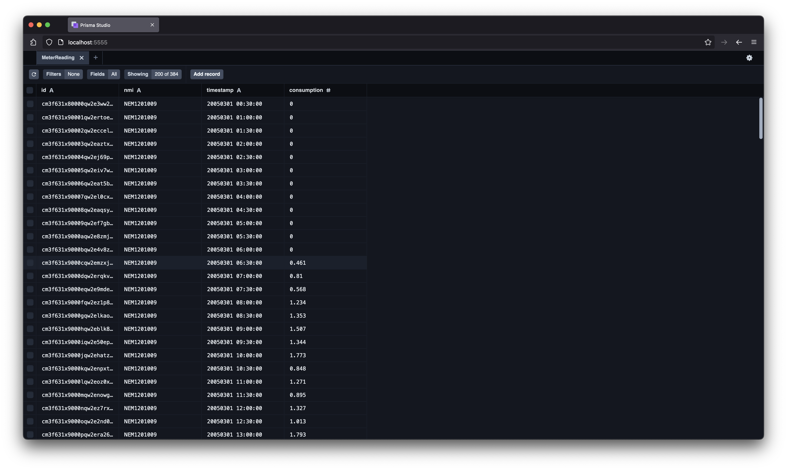

## Installation

```
npm install
```

Note: has only been tested against Node v20.17.0 and npm 10.8.2.

## Running the code

To process a file

```
npm run seed ./data/example1.csv
```

You can check the result by running `npx prisma studio`



To clear the table in SQLite

```
npm run reset
```

## Testing the code

```
npm test
```

Note: there's just one unit test an example
